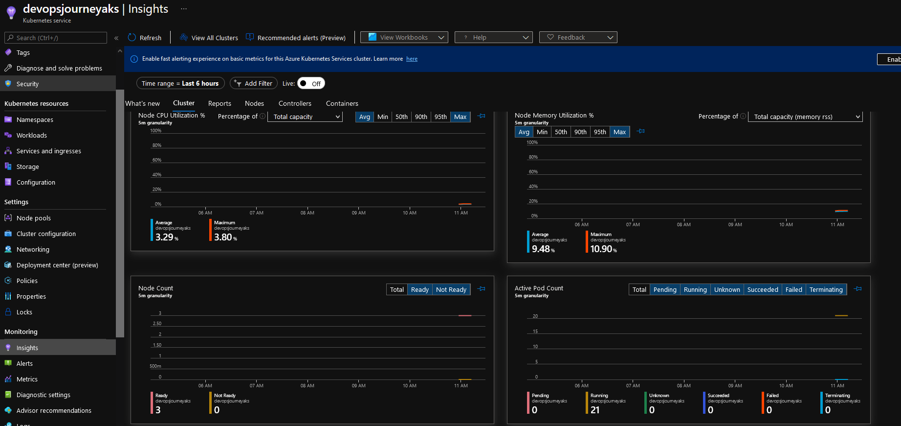

# Reviewing Log Analytics Container Insights

Access to Container insights is available directly from an AKS cluster by selecting Insights > Cluster from the left pane, or when you selected a cluster from the multi-cluster view. Information about your cluster is organized into four perspectives:

- Cluster
- Nodes
- Controllers
- Containers

The default page opens and displays four line performance charts that show key performance metrics of your cluster.

The performance charts display four performance metrics:

- Node CPU utilization %: An aggregated perspective of CPU utilization for the entire cluster. To filter the results for the time range, select Avg, Min, 50th, 90th, 95th, or Max in the percentiles selector above the chart. The filters can be used either individually or combined.
- Node memory utilization %: An aggregated perspective of memory utilization for the entire cluster. To filter the results for the time range, select Avg, Min, 50th, 90th, 95th, or Max in the percentiles selector above the chart. The filters can be used either individually or combined.
- Node count: A node count and status from Kubernetes. Statuses of the cluster nodes represented are Total, Ready, and Not Ready. They can be filtered individually or combined in the selector above the chart.
- Active pod count: A pod count and status from Kubernetes. Statuses of the pods represented are Total, Pending, Running, Unknown, Succeeded, or Failed. They can be filtered individually or combined in the selector above the chart.

This is only an insight into what Container Insights is capable off, review the [Azure Documentation](https://docs.microsoft.com/en-us/azure/azure-monitor/containers/container-insights-analyze) to see further how it can assist you :)